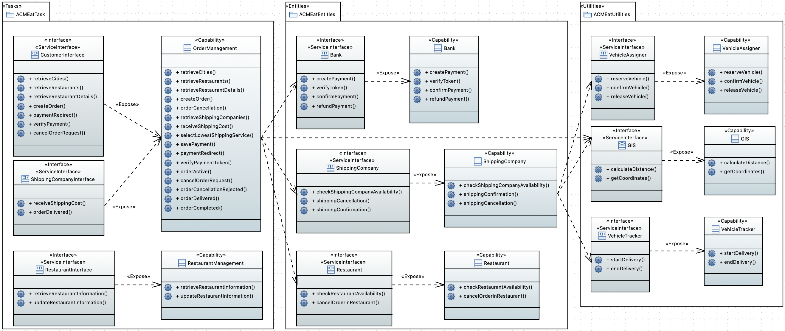

# Relazione progetto ACMEat  
_Corso di Architetture Software a Microservizi – A.A. 2024/2025_

**Progetto realizzato da**: Orazio Andrea Capone (Mat. 1170818) | Matteo Cardellini (Mat. 1186864) | Francesco Goretti (Mat. XXXXXXX)

## Indice
1. [Descrizione del dominio](#1-descrizione-del-dominio)  
2. [Modellazione della coreografia](#2-modellazione-della-coreografia)  
   2.1. [Coreografia principale – Processo di ordinazione](#21-coreografia-principale--processo-di-ordinazione)  
   2.2. [Coreografia secondaria – Aggiornamento informazioni ristorante](#22-coreografia-secondaria--aggiornamento-informazioni-ristorante)  
3. [Modellazione BPMN](#3-modellazione-bpmn)  
4. [Diagramma SOA](#4-diagramma-soa)  

---

## 1. Descrizione del dominio

La società **ACMEat** propone ai propri clienti un servizio che permette di selezionare un menu da uno fra un insieme di locali convenzionati e farselo recapitare a domicilio.

Per poter usufruire del servizio, il cliente deve inizialmente selezionare un comune fra quelli nei quali il servizio è attivo. A fronte di questa selezione, ACMEat presenta la lista dei locali convenzionati che operano in quel comune e dei menù che offrono. Il cliente può quindi specificare il locale e il menù di suo interesse, oltre a una fascia oraria per la consegna (si tratta di fasce di 15 minuti tra le 12:00 e le 14:00 e tra le 19:00 e le 21:00).

Segue quindi una fase di pagamento, che viene gestita attraverso un istituto bancario terzo al quale il cliente viene indirizzato. A fronte del pagamento, l’istituto rilascia un token al cliente, il quale lo comunica ad ACMEat, che a sua volta lo usa per verificare con la banca che il pagamento sia stato effettivamente completato. A questo punto, l’ordine diventa operativo.

I clienti possono comunque ancora annullare l’ordine, ma non più tardi di un’ora prima rispetto all’orario di consegna. In tal caso, ACMEat chiede alla banca l’annullamento del pagamento.

ACMEat conosce tutti i locali convenzionati nei vari comuni nei quali opera, inclusi i loro giorni e orari di operatività. Nel caso in cui un locale non sia disponibile in un giorno in cui dovrebbe normalmente essere aperto, è responsabilità del locale stesso contattare ACMEat entro le 10 del mattino comunicando tale indisponibilità. Entro tale orario vanno anche comunicati eventuali cambiamenti dei menù proposti (in mancanza di tale comunicazione si assume che siano disponibili gli stessi del giorno precedente).

I locali vengono inoltre contattati ad ogni ordine per verificare che siano effettivamente in grado di far fronte alla richiesta del cliente. In caso negativo, l’accettazione dell’ordine si interrompe prima che si passi alla fase di pagamento.

Per la consegna, ACMEat si appoggia a più società esterne: per ogni consegna vengono contattate tutte le società che abbiano sede entro 10 chilometri dal comune interessato, specificando indirizzo del locale dove ritirare il pasto, indirizzo del cliente cui recapitarlo e orario previsto di consegna. A fronte di questa richiesta, le società devono rispondere entro 15 secondi specificando la loro disponibilità e il prezzo richiesto. ACMEat sceglierà fra le società disponibili che avranno risposto nel tempo richiesto quella che propone il prezzo più basso.

Nel caso in cui nessuna società di consegna sia disponibile, l’ordine viene annullato prima che si passi alla fase di pagamento.

---

## 2. Modellazione della coreografia

### 2.1. Coreografia principale – Processo di ordinazione

#### Partecipanti

- **Cliente (customer)**
- **ACMEat**
- **Ristorante (restaurant)**
- **Banca (bank)**
- **Servizio di consegna (shippingCompany)**

#### Coreografia

```text
retrieveCities: ACMEat -> customer ;
selectCity: customer -> ACMEat ;
retrieveRestaurants: ACMEat -> customer ;
selectRestaurant: customer -> ACMEat ;
retrieveMenusAndTimeSlots: ACMEat -> customer ;
selectMenu: customer -> ACMEat ;
selectTimeSlot: customer -> ACMEat ;
enterDeliveryAddress: customer -> ACMEat ;
createOrder: ACMEat -> ACMEat ;
checkRestaurantAvailability: ACMEat -> restaurant ;
(
    confirmRestaurantAvailability: restaurant -> ACMEat ;
    (
        requestShippingCompany: ACMEat -> shippingCompany ;
        sendShippingCost: shippingCompany -> ACMEat
    )* ;
    selectCheapestShippingCompany: ACMEat -> shippingCompany ;
    initilizePayment: ACMEat -> bank ;
    sendPaymentRedirect: bank -> ACMEat ;
    redirectToBank: ACMEat -> customer ;
    makePayment: customer -> bank ;
    sendPaymentToken: bank -> customer ;
    sendPaymentTokenToAcme: customer -> ACMEat ;
    verifyPayment: ACMEat -> bank ;
    (
        confirmPayment: bank -> ACMEat ;
        activateOrder: ACMEat -> customer ;
        (
            requestOrderCancellation: customer -> ACMEat ;
            cancelOrder: customer -> ACMEat ;
            checkCancellationTime: ACMEat -> ACMEat ;
            (
                cancelOrder: ACMEat -> customer ;
                cancelOrderInRestaurant: ACMEat -> restaurant ;
                paymentRefund: ACMEat -> bank ;
                cancelOrderInShippingCompany: ACMEat -> shippingCompany
            )
            +
            (
                rejectCancellation: ACMEat -> customer ;
                orderDelivered: shippingCompany -> ACMEat ;
                confirmPayment: ACMEat -> bank ;
                orderCompleted: ACMEat -> customer
            )
        )
        +
        (
            orderDelivered: shippingCompany -> ACMEat ;
            confirmPayment: ACMEat -> bank ;
            orderCompleted: ACMEat -> customer
        )
    )
    +
    (
        rejectPayment: bank -> ACMEat ;
        cancelOrder: ACMEat -> customer ;
        cancelOrderInRestaurant: ACMEat -> restaurant ;
        cancelOrderInShippingCompany: ACMEat -> shippingCompany
    )
)
+
(
    rejectShippingCompany: shippingCompany -> ACMEat ;
    cancelOrder: ACMEat -> customer ;
    cancelOrderInRestaurant: ACMEat -> restaurant
)
+
(
    rejectRestaurantAvailability: restaurant -> ACMEat ;
    cancelOrder: ACMEat -> customer
)
```

#### Discussione sulla connectedness
La coreografia principale è connessa:
- Ogni sequenza rispetta la condizione di *connectedness for sequence*: i partecipanti nelle interazioni successive sono legati da un ruolo in commune.
- Le scelte condizionali (+) sono strutturate correttamente e coinvolgono ruoli coerenti nei rami alternativi (*connectedness for choice*).
- Le iterazioni (richieste alle società di consegna) sono rappresentate con (*) e non violano la correttezza.
La proiezione è dunque sintatticamente corretta e realizzabile nei singoli ruoli.

#### Proiezione sui ruoli
```text
proj(C, customer) = 
    retrieveCities^@ACMEat ;
    selectCity@ACMEat ;
    retrieveRestaurants^@ACMEat ;
    selectRestaurant@ACMEat ;
    retrieveMenusAndTimeSlots^@ACMEat ;
    selectMenu@ACMEat ;
    selectTimeSlot@ACMEat ;
    enterDeliveryAddress@ACMEat ;
    redirectToBank^@ACMEat ;
    makePayment@bank ;
    sendPaymentToken^@bank ;
    sendPaymentTokenToAcme@ACMEat ;
    (
        requestOrderCancellation@ACMEat ;
        cancelOrder@ACMEat ;
        (
            cancelOrder^@ACMEat ;
            orderCompleted^@ACMEat
        )
        +
        (
            rejectCancellation^@ACMEat ;
            orderCompleted^@ACMEat
        )
    )
    +
    orderCompleted^@ACMEat
```

```text
proj(C, ACMEat) =
    retrieveCities@customer ;
    selectCity^@customer ;
    retrieveRestaurants@customer ;
    selectRestaurant^@customer ;
    retrieveMenusAndTimeSlots@customer ;
    selectMenu^@customer ;
    selectTimeSlot^@customer ;
    enterDeliveryAddress^@customer ;
    createOrder@ACMEat ;
    checkRestaurantAvailability@restaurant ;
    (
        confirmRestaurantAvailability^@restaurant ;
        (
            requestShippingCompany@shippingCompany ;
            sendShippingCost^@shippingCompany
        )* ;
        selectCheapestShippingCompany@shippingCompany ;
        initilizePayment@bank ;
        sendPaymentRedirect^@bank ;
        redirectToBank@customer ;
        makePayment^@customer ;
        sendPaymentToken^@bank ;
        sendPaymentTokenToAcme^@customer ;
        verifyPayment@bank ;
        (
            confirmPayment^@bank ;
            activateOrder@customer ;
            (
                requestOrderCancellation^@customer ;
                cancelOrder^@customer ;
                checkCancellationTime@ACMEat ;
                (
                    cancelOrder@customer ;
                    cancelOrderInRestaurant@restaurant ;
                    paymentRefund@bank ;
                    cancelOrderInShippingCompany@shippingCompany
                )
                +
                (
                    rejectCancellation@customer ;
                    orderDelivered^@shippingCompany ;
                    confirmPayment@bank ;
                    orderCompleted@customer
                )
            )
            +
            (
                orderDelivered^@shippingCompany ;
                confirmPayment@bank ;
                orderCompleted@customer
            )
        )
        +
        (
            rejectPayment^@bank ;
            cancelOrder@customer ;
            cancelOrderInRestaurant@restaurant ;
            cancelOrderInShippingCompany@shippingCompany
        )
    )
    +
    (
        rejectShippingCompany^@shippingCompany ;
        cancelOrder@customer ;
        cancelOrderInRestaurant@restaurant
    )
    +
    (
        rejectRestaurantAvailability^@restaurant ;
        cancelOrder@customer
    )
```

```text
proj(C, restaurant) =
    checkRestaurantAvailability^@ACMEat ;
    (
        confirmRestaurantAvailability@ACMEat ;
        cancelOrderInRestaurant^@ACMEat +
        cancelOrderInRestaurant^@ACMEat +
        cancelOrderInRestaurant^@ACMEat
    )
    +
    (
        rejectRestaurantAvailability@ACMEat
    )
```

```text
proj(C, shippingCompany) =
    (
        requestShippingCompany^@ACMEat ;
        sendShippingCost@ACMEat
    )* ;
    selectCheapestShippingCompany^@ACMEat ;
    (
        orderDelivered@ACMEat ;
        cancelOrderInShippingCompany^@ACMEat +
        cancelOrderInShippingCompany^@ACMEat +
        cancelOrderInShippingCompany^@ACMEat
    )
    +
    rejectShippingCompany@ACMEat
```

```text
proj(C, bank) =
    initilizePayment^@ACMEat ;
    makePayment^@customer ;
    sendPaymentRedirect@ACMEat ;
    sendPaymentToken@customer ;
    verifyPayment^@ACMEat ;
    (
        confirmPayment@ACMEat +
        rejectPayment@ACMEat
    ) ;
    paymentRefund^@ACMEat
```

### 2.2. Coreografia secondaria – Aggiornamento informazioni ristorante

#### Partecipanti
- **Ristorante (restaurant)**
- **ACMEat**

#### Coreografia

```text
requestCurrentInfo: restaurant -> ACMEat ;
checkTime: ACMEat -> ACMEat ;
(
    sendCurrentInfo: ACMEat -> restaurant ;
    sendUpdatedInfo: restaurant -> ACMEat ;
    confirmUpdate: ACMEat -> restaurant
)
+
(
    rejectUpdate: ACMEat -> restaurant
)
```

#### Discussione sulla connectedness
La coreografia è connessa e correttamente strutturata:
- La sequenza di messaggi rispetta la condizione di *connectedness for sequence*.
- La scelta condizionale (+) avviene dopo una valutaziona interna (`checkTime`) e coinvolge gli stessi ruoli nei due rami.
- Non ci sono interazioni isolate né ruoli che compaiono in un solo ramo.

#### Proiezione sui ruoli
```text
proj(C, restaurant) =
    requestCurrentInfo@ACMEat ;
    (
        sendCurrentInfo^@ACMEat ;
        sendUpdatedInfo@ACMEat ;
        confirmUpdate^@ACMEat
    )
    +
    rejectUpdate^@ACMEat
```

```text
proj(C, ACMEat) =
    requestCurrentInfo^@restaurant ;
    checkTime@ACMEat ;
    (
        sendCurrentInfo@restaurant ;
        sendUpdatedInfo^@restaurant ;
        confirmUpdate@restaurant
    )
    +
    rejectUpdate@restaurant
```
---

## 3. Modellazione BPMN
Il processo è stato modellato utilizzando il linguaggio BPMN 2.0 con una notazione collaborativa. Ogni partecipante al sistema (cliente, ACMEat, ristorante, compagnia di spedizione, banca) è rappresentato da una pool distinta, evidenziando i messaggi scambiati e i diversi flussi decisionali.


> *Il file originale in formato BPMN è disponibile qui: [`acmeat.bpmn`](../srcs/ACMEat/backend/src/main/resources/acmeat.bpmn)*

---

## 4. Diagramma SOA
Il seguente diagramma SOA, modellato secondo lo stile TinySOA, rappresenta le capability offerte dal sistema ACMEat e le relative interfacce esposte, oltre alle dipendenze verso i servizi esterni coinvolti nel processo (banca, ristoranti, compagnie di spedizione, GIS).



> *Il progetto Papyrus originale è disponibile qui : [`TinySOA_ACMEat`](./TinySOA-ACMEat)*

---